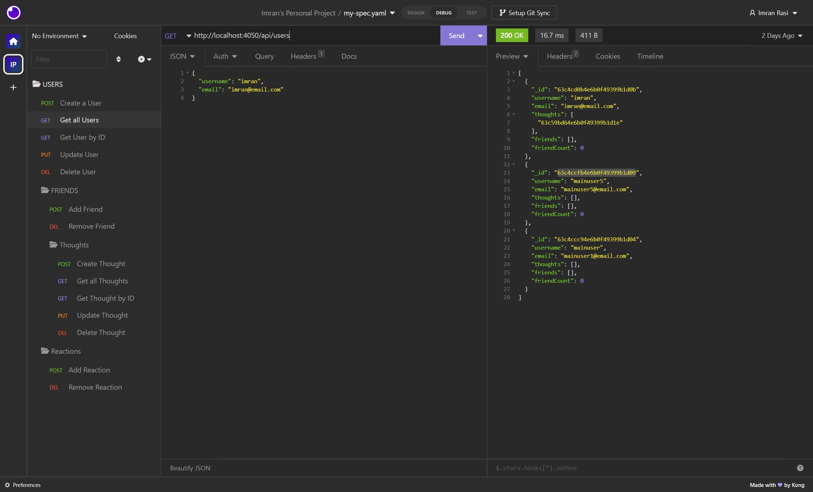

# Imrans-Social-Network-API

## Description

The Social Network API is a project where I built the APIs on the backend for a social network web application. It allows users to share their thoughts, are able to react to friend's thoughts, and create a friends list. This is an API for a social network web application where users can share their thoughts, react to friends' thoughts, and create a friend list. It uses Express.js for routing, a MongoDB database, the Mongoose ODM, and native JavaScript Date object to format timestamps. The seed data is created using Insomnia.

## Table of Contents
* [Installation](#installation)
* [Video Walk Through](#videowalkthrough)
* [Usage](#usage)
* [License](#license)
* [Credits](#credits)
* [Questions](#questions)

## Installation

1. Clone the repository.
2. Run "npm i" to install the npm packages.
3. Do the "npm init"
4. Create the "dotenv" file.
5. Set up the the dotenv to connect to the Mongo and Port.

## Video Walk Through

* You also can go through that link for a better look <a href="https://drive.google.com/file/d/1QuRfxqSYMGnaCaKIVXkTyDJaukKP_DLz/view">Video</a>

## Usage 

1. To invoke the application, run `npm start`..
2. When the server is started, the Mongoose models are synched to the MongoDB database.
3. Open MongoDB and connect to the MongoDB URI `mongodb://localhost:27017`. On the list of databases, click on `social_DB` to see `thoughts` and `users` data.
4. To create seed data and test the API routes, use [Insomnia](https://insomnia.rest/download). Also, see the Tests section below.

 

## License

[MIT License](./LICENSE)

## Credits

- [JavaScript](https://developer.mozilla.org/en-US/docs/Web/JavaScript)
- [Express.js](https://expressjs.com/)
- [Node.js](https://nodejs.org/en/)
- [MongoDB](https://www.mongodb.com/)
- [Mongoose](https://mongoosejs.com/)
- [Insomnia](https://insomnia.rest/)

## Questions

If you have any Questions :
  * Email : imran.rassi.2020@gmail.com
  * GitHub: [imran7rassi](https://github.com/imran7rassi)